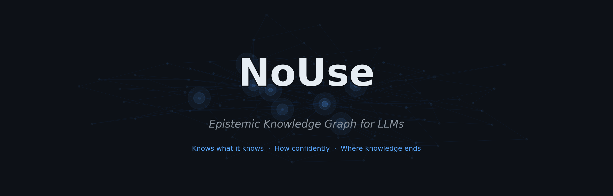

<p align="center">
  
</p>

<p align="center">
  <strong>An 8B model with NoUse outperforms a 70B model without it.</strong>
</p>

<p align="center">
  <a href="https://pypi.org/project/nouse/"></a>
  <a href="https://github.com/base76-research-lab/NoUse/actions/workflows/tests.yml"></a>
  <a href="https://www.python.org/downloads/"></a>
  <a href="LICENSE"></a>
  <a href="eval/RESULTS.md"></a>
</p>

<p align="center">
  <a href="#quick-start">Quick Start</a> · <a href="#the-result">Benchmark</a> · <a href="#how-it-works">How It Works</a> · <a href="#how-nouse-differs-from-alternatives">vs Alternatives</a> · <a href="#use-with-openai-anthropic-or-ollama">Examples</a> · <a href="#research">Research</a> · <a href="#roadmap">Roadmap</a>
</p>

<p align="center">
  
</p>

---

## Try NoUse In 60 Seconds

```bash
pip install nouse
python - <<'PY'
import nouse

brain = nouse.attach()
result = brain.query("What does this project know about epistemic grounding?")

print(result.context_block())
print("confidence:", round(result.confidence, 2))
PY
```

If NoUse already knows something relevant, you get back a grounded context block with validated relations, uncertainty, and explicit boundaries instead of a generic answer blob.

If that output feels more useful than plain chat history or chunk retrieval, then the project is doing its job.

---

## Why It Matters

NoUse gives an LLM agent a persistent epistemic memory layer.

- It stores relations, not just retrieved chunks.
- It carries confidence, rationale, and uncertainty with the memory itself.
- It makes the boundary between known, probable, and unknown visible to the model.

That changes agent behavior in the place that actually matters: when a model is close to hallucinating but still sounds fluent.

## The Result

```text
Model                               Score   Questions
─────────────────────────────────────────────────────
llama3.1-8b  (no memory)            46%     60
llama-3.3-70b  (no memory)          47%     60
llama3.1-8b  + Nouse memory  →      96%     60
```

**An 8B model with Nouse outperforms a 70B model without it.**

The effect is not retrieval. It is *epistemic grounding* — a small, precise knowledge signal
redirects the model's existing priors onto the correct frame, with confidence and evidence attached.
We call this the **Intent Disambiguation Effect**.

→ Full benchmark details: [eval/RESULTS.md](eval/RESULTS.md) · [Run it yourself](#run-the-benchmark-yourself)

---

## What You Get

| Capability | What it does |
| --- | --- |
| Structured memory | Stores typed relations between concepts instead of plain text chunks |
| Confidence-aware retrieval | Returns what is known, with evidence and uncertainty attached |
| Gap awareness | Surfaces where knowledge ends instead of bluffing through it |
| Continuous learning | Strengthens or weakens graph paths over time via Hebbian plasticity |
| Local-first runtime | Runs as a local graph and daemon, then injects context into any LLM |

---

## What Nouse Is

Nouse (νοῦς, Gk. *mind*) is a **persistent, self-growing epistemic substrate** that attaches to any LLM.

It is informed by brain-inspired plasticity, cognitive research, and the practical failure modes of LLM memory.

```text
Your documents, conversations, research
           ↓
    Nouse knowledge graph
    (SQLite WAL + NetworkX + Hebbian learning + evidence scoring)
           ↓
    brain.query("your question")
           ↓
    Structured context injected into any LLM prompt:
      — what is known (relations + confidence)
      — why it is known (evidence chain)
      — what is NOT known (gap map from TDA)
```

It is **not** a RAG system. RAG retrieves chunks. Nouse extracts *relations* — typed, weighted,
evidence-scored connections between concepts — and injects a compact, structured context block.

It is **not** just a memory system. Memory stores and retrieves. Nouse maintains an epistemic
account: every relation carries a trust tier (hypothesis / indication / validated), a rationale,
and a contradiction flag. The system knows the difference between what it has evidence for
and what it is guessing.

It **learns continuously**. Every interaction strengthens or weakens connections (Hebbian plasticity).
There is no retraining. No gradient descent. The graph grows — and the gaps become visible.

---

## How Nouse Differs From Alternatives

| System | Main unit | Knows confidence | Knows what's missing | Learns over time | Local-first |
| --- | --- | :---: | :---: | :---: | :---: |
| **Basic RAG** | text chunk | ✗ | ✗ | ✗ | ✓ |
| **Vector memory** | embedding | ~ | ✗ | ✗ | ✓ |
| **Mem0** | memory objects | ~ | ✗ | ~ | ✓ |
| **MemGPT / Letta** | conversation pages | ✗ | ✗ | ~ | ✗ |
| **Claude Memory** | key-value | ✗ | ✗ | ✗ | ✗ |
| **Nouse** | typed relation + evidence | **✓** | **✓** | **✓** | **✓** |

Nouse is not trying to replace the model. It gives the model a brain-like memory substrate it can query before speaking.

---

## Quick start

```bash
pip install nouse
```

```python
import nouse

# Auto-detects the local daemon if it is running.
# Otherwise falls back to direct local graph access.
brain = nouse.attach()

result = brain.query("transformer attention mechanism")

print(result.context_block())
print(result.confidence)
print(result.strong_axioms())
```

If the daemon is running, `attach()` connects over HTTP. Otherwise it falls back to direct local graph access. The same code works either way.

Works with any provider — OpenAI, Anthropic, Groq, Cerebras, Ollama:

```python
# You handle the LLM call. Nouse handles the memory.
context = brain.query(user_question).context_block()
response = openai.chat(messages=[
    {"role": "system", "content": context},
    {"role": "user",   "content": user_question},
])
```

## Use With OpenAI, Anthropic, Or Ollama

### OpenAI

```python
from openai import OpenAI
import nouse

client = OpenAI()
brain = nouse.attach()

question = "How does residual attention affect token relevance?"
context = brain.query(question).context_block()

response = client.chat.completions.create(
       model="gpt-4.1-mini",
       messages=[
              {"role": "system", "content": context},
              {"role": "user", "content": question},
       ],
)

print(response.choices[0].message.content)
```

### Anthropic

```python
from anthropic import Anthropic
import nouse

client = Anthropic()
brain = nouse.attach()

question = "What does this repo know about topological plasticity?"
context = brain.query(question).context_block()

response = client.messages.create(
       model="claude-3-7-sonnet-latest",
       max_tokens=800,
       system=context,
       messages=[
              {"role": "user", "content": question},
       ],
)

print(response.content[0].text)
```

### Ollama

```python
import ollama
import nouse

brain = nouse.attach()

question = "Summarize what is known about epistemic grounding."
context = brain.query(question).context_block()

response = ollama.chat(
       model="qwen3.5:latest",
       messages=[
              {"role": "system", "content": context},
              {"role": "user", "content": question},
       ],
)

print(response["message"]["content"])
```

The pattern is always the same: `brain.query(...)` first, provider call second.

---

## Managed NoUse (Coming)

NoUse is local-first today. A managed cloud version is planned:

```python
brain = nouse.attach(api_key="nouse_sk_...")
```

Hosted memory graphs, shared project memory across agents and teams, and zero local setup.
Interested? [Get in touch](mailto:bjorn@base76research.com).

---

## What A Grounded Answer Looks Like

When you query NoUse, the model does not just get a blob of context. It gets an epistemic frame:

```text
[Nouse memory]
• transformer attention: mechanism for routing token influence across context
       claim: attention modulates token relevance based on learned relational patterns

Validated relations:
       transformer —[uses]→ attention  [ev=0.92]
       attention —[modulates]→ token relevance  [ev=0.81]

Uncertain / under review:
       attention —[is_equivalent_to]→ memory routing  [ev=0.41] ⚑
```

That is the real product surface: not storage, but a more honest and better-calibrated answer path.

---

## Run the benchmark yourself

```bash
git clone https://github.com/base76-research-lab/NoUse
cd NoUse
pip install -e .

# Generate questions from your own graph
python eval/generate_questions.py --n 60

# Run benchmark (requires Cerebras or Groq API key, or use Ollama)
python eval/run_eval.py \
  --small cerebras/llama3.1-8b \
  --large groq/llama-3.3-70b-versatile \
  --n 60 --no-judge
```

The current benchmark is domain-specific and intentionally small. Its purpose is to test whether a grounded memory signal can redirect the model onto the right frame, not to claim a universal leaderboard win.

---

## How the graph grows

```text
Read a document / have a conversation
           ↓
    nouse daemon (background)
           ↓
    DeepDive: extract concepts + relations
           ↓
    Hebbian update: strengthen confirmed paths
           ↓
    NightRun: consolidate, prune weak edges
           ↓
    Ghost Q (nightly): ask LLM about weak nodes → enrich graph
```

The daemon runs as a systemd service. It watches your files, chat history,
browser bookmarks — anything you configure. You never manually curate the graph.

---

## Good Fits

- Coding agents that need stable project memory across sessions
- Research copilots that must preserve terminology, evidence, and uncertainty
- Domain-specific assistants where bluffing is worse than saying "unknown"
- Local-first AI workflows where you want observability instead of hidden memory state

---

## Architecture

```text
nouse/
├── inject.py          # Public API: attach(), NouseBrain, Axiom, QueryResult
├── field/
│   └── surface.py     # SQLite WAL + NetworkX graph interface
├── daemon/
│   ├── main.py        # Autonomous learning loop
│   ├── nightrun.py    # Nightly consolidation (9 phases)
│   ├── node_deepdive.py  # 5-step concept extraction
│   └── ghost_q.py     # LLM-driven graph enrichment
├── limbic/            # Neuromodulation (relevance, arousal, novelty)
├── memory/            # Episodic + procedural + semantic memory
├── metacognition/     # Self-monitoring and confidence calibration
└── search/
    └── escalator.py   # 3-level knowledge escalation
```

---

## The hypothesis (work in progress)

```text
small model + Nouse[domain]  >  large model without Nouse
```

We have evidence for this in our benchmark. The next step is to test across
more domains, more models, and with an LLM judge instead of keyword scoring.

Contributions welcome — especially domain-specific question banks.

---

## Research

The theoretical foundation for Nouse is described in:

- Wikström, B. (2026). **The Larynx Problem: Why Large Language Models Are Not Artificial Intelligence.** [Zenodo](https://zenodo.org/records/19413234) · [PhilPapers](https://philpapers.org/rec/WIKTLP)

The paper argues that LLMs model the output channel of intelligence (language), not intelligence itself — and that epistemic grounding through structured, plastic knowledge graphs is a necessary complement.

---

## Install & Run Daemon

```bash
pip install nouse

# Start the learning daemon
nouse daemon start

# Interactive REPL with memory
nouse run

# Check graph stats
nouse status
```

Requires Python 3.11+. Graph stored in `~/.local/share/nouse/`.

---

## Roadmap

| Phase | Status | Description |
| --- | :---: | --- |
| **Core engine** | ✅ | SQLite WAL + NetworkX + Hebbian plasticity + TDA gap detection |
| **Multi-provider** | ✅ | OpenAI, Anthropic, Ollama, Groq, Cerebras |
| **MCP integration** | ✅ | Model Context Protocol server for Claude and compatible clients |
| **Cross-domain benchmarks** | 🔄 | Validating on external datasets beyond internal domain |
| **Docker support** | 📋 | One-command deployment for teams |
| **Managed cloud** | 📋 | `nouse.attach(api_key="nouse_sk_...")` — hosted brain for teams |
| **Multi-tenant API** | 📋 | Shared project memory, team collaboration, SLAs |

---

## License

MIT — see [LICENSE](LICENSE)

---

## Contact

Björn Wikström / [Base76 Research Lab](https://github.com/base76-research-lab)

- 𝕏 / Twitter: [@Q_for_qualia](https://x.com/Q_for_qualia)
- LinkedIn: [bjornshomelab](https://www.linkedin.com/in/bjornshomelab/)
- Email: [bjorn@base76research.com](mailto:bjorn@base76research.com)
- Issues: [GitHub Issues](https://github.com/base76-research-lab/NoUse/issues)

For security vulnerabilities, see [SECURITY.md](SECURITY.md).
