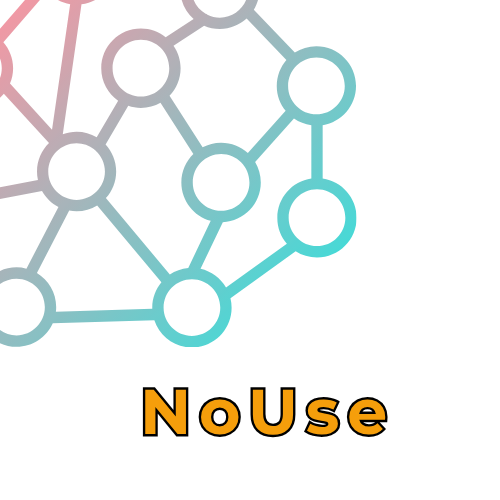

<p align="center">
  
</p>

<h1 align="center">Nouse</h1>

<p align="center">
  <strong>Persistent domain memory for LLMs. Works with any model.</strong>
</p>

<p align="center">
  <a href="https://www.python.org/downloads/"></a>
  <a href="https://opensource.org/licenses/MIT"></a>
  <a href="eval/RESULTS.md"></a>
</p>

---

## The result that motivated this

```
Model                               Score   Questions
─────────────────────────────────────────────────────
llama3.1-8b  (no memory)            46%     60
llama-3.3-70b  (no memory)          47%     60
llama3.1-8b  + Nouse memory  →      96%     60
```

**An 8B model with Nouse outperforms a 70B model without it.**

The effect is not about retrieval. It is about *disambiguation* — a small, precise knowledge signal
redirects the model's existing priors onto the correct frame. We call this the
**Intent Disambiguation Effect**.

→ Full benchmark: [eval/RESULTS.md](eval/RESULTS.md)

---

## What Nouse is

Nouse (νοῦς, Gk. *mind*) is a **persistent, self-growing knowledge graph** that attaches to any LLM
as a memory substrate.

```
Your documents, conversations, research
           ↓
    Nouse knowledge graph
    (KuzuDB + Hebbian learning)
           ↓
    brain.query("your question")
           ↓
    Structured context injected into any LLM prompt
```

It is **not** a RAG system. RAG retrieves chunks. Nouse extracts *relations* — typed, weighted,
evidence-scored connections between concepts — and injects a compact, structured context block.

It **learns continuously**. Every interaction strengthens or weakens connections (Hebbian plasticity).
There is no retraining. No gradient descent. The graph grows.

---

## Quick start

```bash
pip install nouse

# Attach to your knowledge graph
import nouse
brain = nouse.attach()

# Query and inject context
result = brain.query("transformer attention mechanism")
print(result.context_block())   # inject this into your LLM prompt
print(result.confidence)        # 0.0 – 1.0
print(result.strong_axioms())   # verified high-evidence relations
```

Works with any provider — OpenAI, Anthropic, Groq, Cerebras, Ollama:

```python
# You handle the LLM call. Nouse handles the memory.
context = brain.query(user_question).context_block()
response = openai.chat(messages=[
    {"role": "system", "content": context},
    {"role": "user",   "content": user_question},
])
```

---

## Run the benchmark yourself

```bash
git clone https://github.com/base76-research-lab/NoUse
cd NoUse
pip install -e .

# Generate questions from your own graph
python eval/generate_questions.py --n 60

# Run benchmark (requires Cerebras or Groq API key, or use Ollama)
python eval/run_eval.py \
  --small cerebras/llama3.1-8b \
  --large groq/llama-3.3-70b-versatile \
  --n 60 --no-judge
```

---

## How the graph grows

```
Read a document / have a conversation
           ↓
    nouse daemon (background)
           ↓
    DeepDive: extract concepts + relations
           ↓
    Hebbian update: strengthen confirmed paths
           ↓
    NightRun: consolidate, prune weak edges
           ↓
    Ghost Q (nightly): ask LLM about weak nodes → enrich graph
```

The daemon runs as a systemd service. It watches your files, chat history,
browser bookmarks — anything you configure. You never manually curate the graph.

---

## Architecture

```
nouse/
├── inject.py          # Public API: attach(), NouseBrain, Axiom, QueryResult
├── field/
│   └── surface.py     # KuzuDB graph interface
├── daemon/
│   ├── main.py        # Autonomous learning loop
│   ├── nightrun.py    # Nightly consolidation (9 phases)
│   ├── node_deepdive.py  # 5-step concept extraction
│   └── ghost_q.py     # LLM-driven graph enrichment
└── search/
    └── escalator.py   # 3-level knowledge escalation
```

---

## The hypothesis (work in progress)

```
small model + Nouse[domain]  >  large model without Nouse
```

We have evidence for this in our benchmark. The next step is to test across
more domains, more models, and with an LLM judge instead of keyword scoring.

Contributions welcome — especially domain-specific question banks.

---

## Install & run daemon

```bash
pip install -e ".[dev]"

# Start the learning daemon
nouse daemon start

# Interactive REPL with memory
nouse run

# Check graph stats
nouse status
```

Requires Python 3.11+. Graph stored in `~/.local/share/nouse/field.kuzu`.

---

## License

MIT — Björn Wikström / Base76 Research Lab
